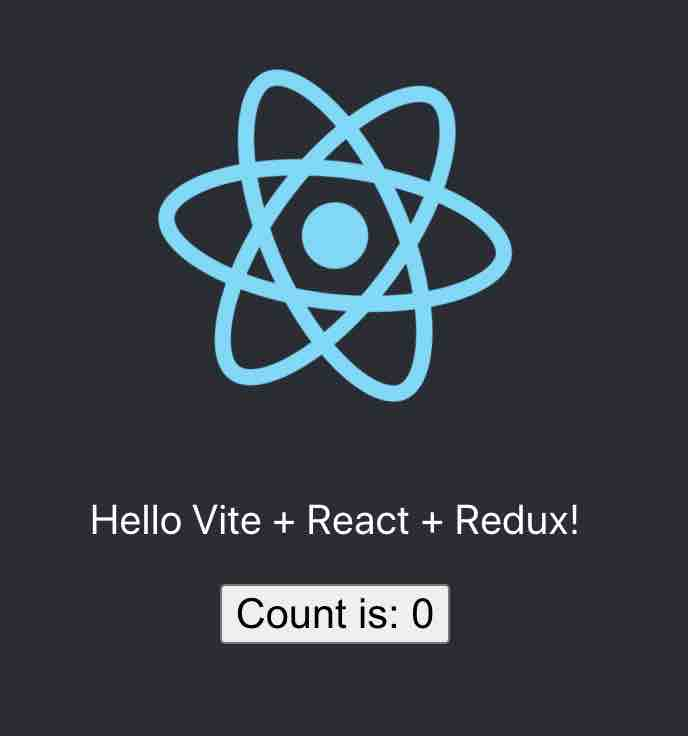

<div align="center">
  <h3>A react-redux starter with vite</h3>
  

  <p>
    <a href="#">
      
    </a>
    <a href="#">
      
    </a>
  </p>
</div>

---

## Install
```bash
npm install 
```


## Development
```bash
npm run dev 
```

## Build
```bash
npm run build 
```

## Serve
```bash
npm run serve 
```

## licence

MIT [@vikbert](https://vikbert.github.io/)
